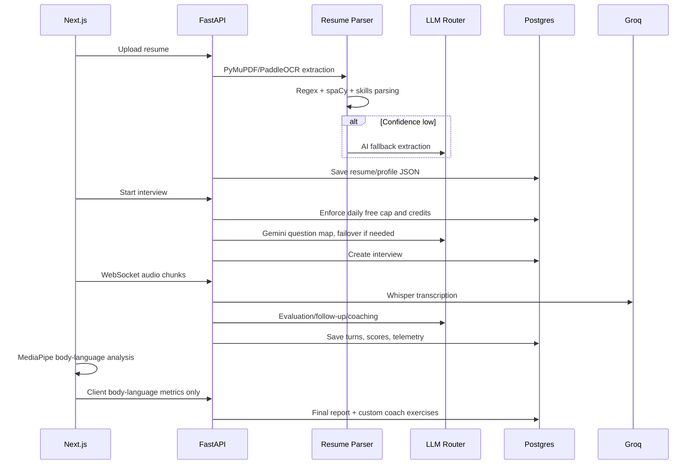

# InterAI V1 Architecture

InterAI is a FastAPI + Next.js interview-practice platform. V1 uses deterministic parsing first, AI only where it materially improves interview generation or coaching, and keeps sensitive media processing on the client.

## V1 Stack

| Area | V1 Choice |
| --- | --- |
| Resume extraction | PyMuPDF text extraction with PaddleOCR fallback for scanned PDFs |
| Resume parsing | Rule-based parser using regex, optional spaCy NER, and an EMSI-compatible skill lexicon |
| Resume AI fallback | Only when rule-parser confidence is below `RESUME_AI_FALLBACK_CONFIDENCE` |
| Interview generation | Gemini 2.5 Flash primary, Groq fallback, OpenAI emergency fallback |
| Observability | Langfuse-compatible AI events, optional PostHog, optional Sentry |
| STT | Groq Whisper |
| TTS | Kokoro-82M self-hosted |
| Body language | Browser MediaPipe only; no video frames over WebSocket |
| Technical mode | Monaco editor, Piston execution, Excalidraw system-design whiteboard, anti-cheat events |
| Payments | Razorpay only |
| Free cap | 3 free interviews per user per day |

## Core Flow

## Important Files

- `resume_parser.py`: PyMuPDF extraction plus PaddleOCR OCR fallback.
- `resume_rules.py`: deterministic resume profile extraction.
- `llm_router.py`: Gemini to Groq to OpenAI failover with telemetry.
- `ai_services.py`: Groq Whisper STT, Kokoro speech, evaluation, hints.
- `interview.py`: interview lifecycle, daily free cap, browser metric ingestion, anti-cheat event logging.
- `technical_mode.py`: technical rounds, Piston execution, Excalidraw state persistence.
- `coach.py`: creates four adaptive exercise types after each interview.
- `observability.py`: Sentry/PostHog/Langfuse-compatible event plumbing.

## Production Essentials

- `/health`: machine health checks for API, database, Redis, LLM config, STT, and payments.
- `/api/status`: public status payload used by the frontend status page.
- `/status`: frontend status page.
- `/terms` and `/privacy`: legal pages.

## Dropped From V1

Stripe, DeepFace, Docling, OpenAI Whisper, OpenAI TTS, and server-side video frame processing are not part of the V1 path.
