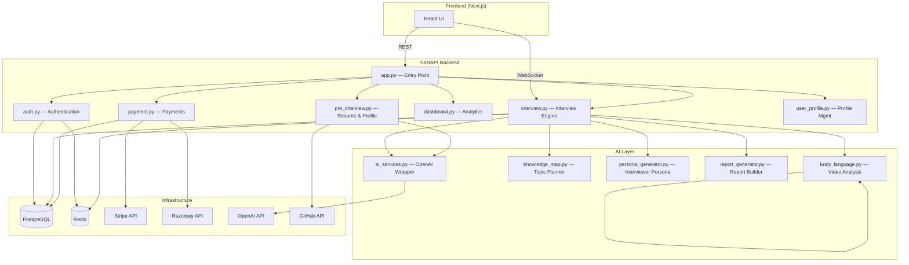
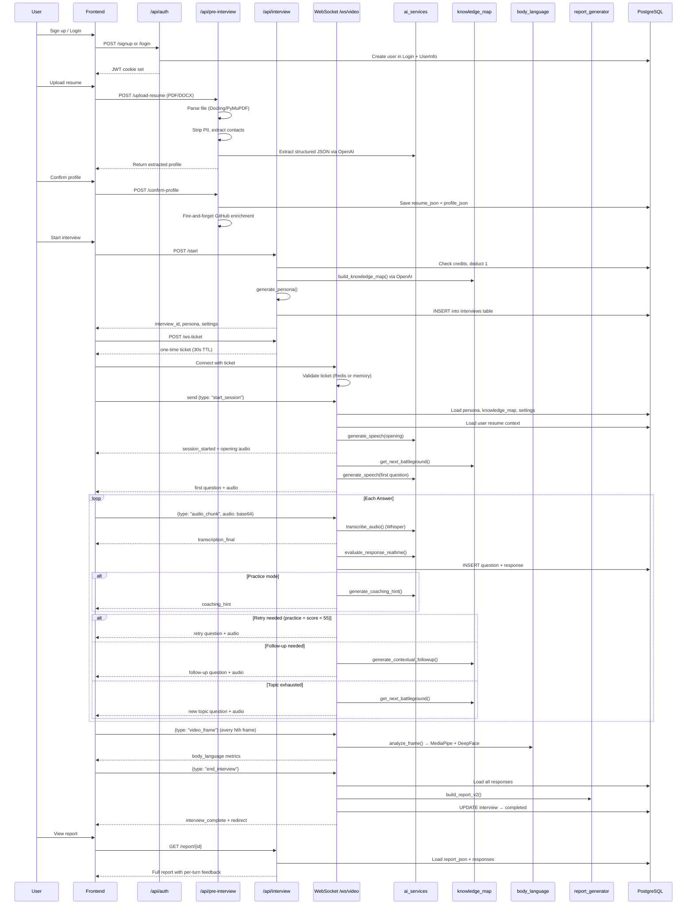
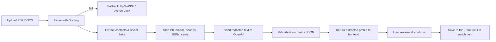
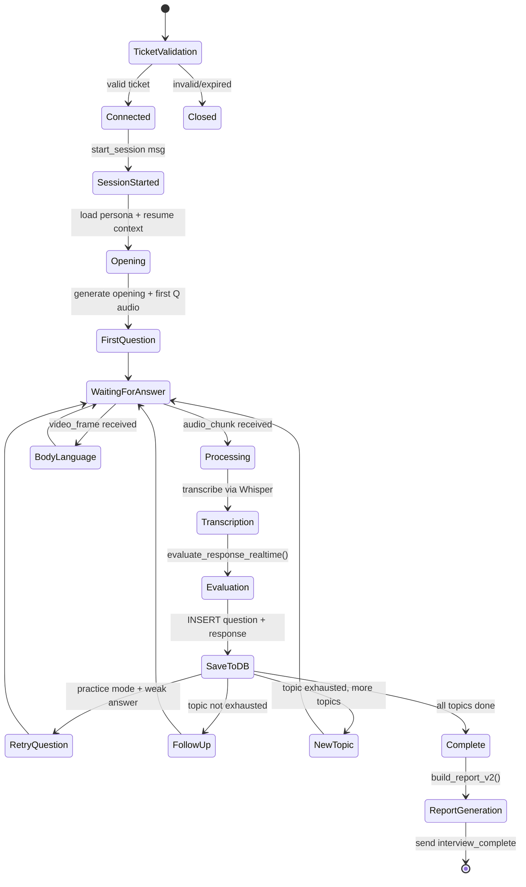
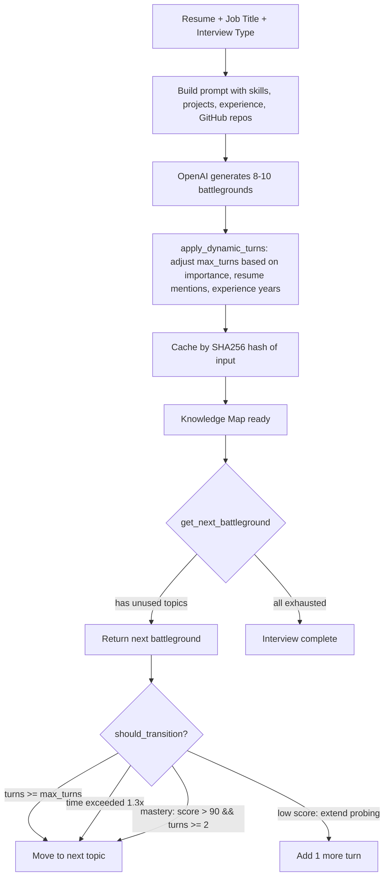
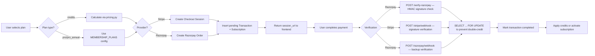
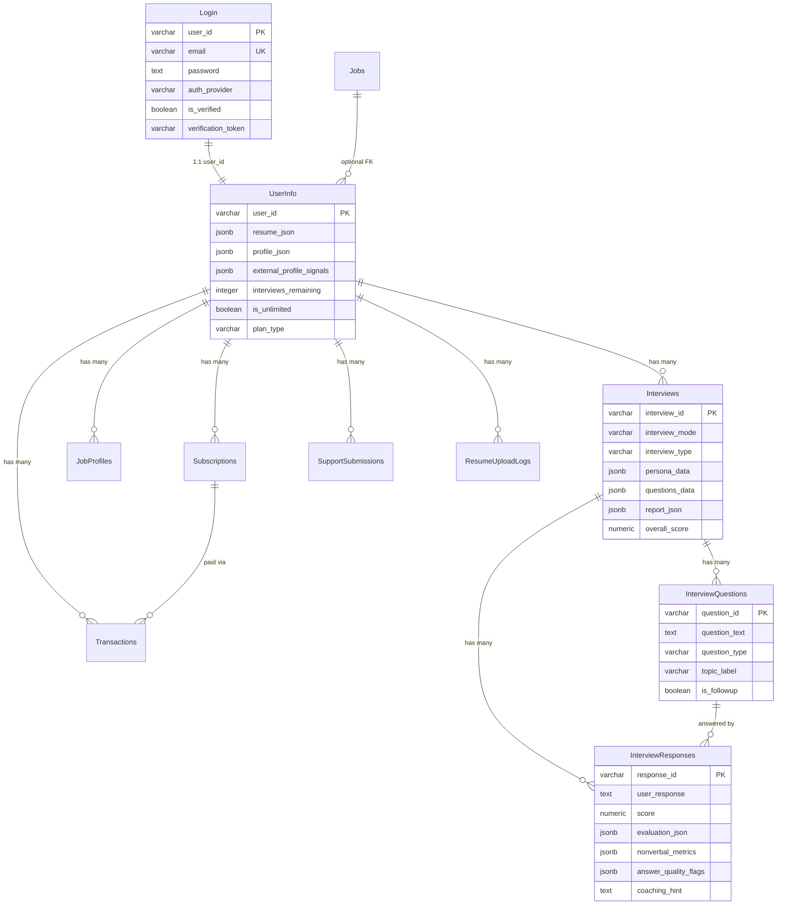

# InterAI — Backend Architecture

## System Overview

InterAI is an AI-powered interview practice platform. The backend is a **FastAPI** monolith that orchestrates real-time video interviews via WebSocket, uses **OpenAI** for speech-to-text, text-to-speech, and response evaluation, **MediaPipe + DeepFace** for body language analysis, and **PostgreSQL + Redis** for persistence and caching.

---

## High-Level Architecture

---

## Complete User Journey

---

## File-by-File Breakdown

### Core Application

#### `app.py` — Application Entry Point
The FastAPI app factory. On startup it initializes the PostgreSQL connection pool, applies runtime schema migrations, connects to Redis, and starts a background task that checks for expired subscriptions every hour. It registers six routers under `/api/auth`, `/api/profile`, `/api/dashboard`, `/api/payment`, `/api/interview`, and `/api/pre-interview`. It also attaches security headers middleware (X-Frame-Options, CSP, etc.) and CORS middleware. A global exception handler catches unhandled errors and returns 500s. The health endpoint pings both Postgres and Redis to report system status.

#### `config.py` — Centralized Configuration
A single `Settings` class that reads every environment variable the app needs — OpenAI keys, Postgres credentials, JWT secrets, Stripe/Razorpay keys, Redis connection info, rate limits, cookie settings, and AI model names. On import it validates that critical secrets (OPENAI_API_KEY, JWT_SECRET) are present and not placeholder values. All other modules import `settings` from here.

#### `database.py` — PostgreSQL Connection Layer
Creates a `ThreadedConnectionPool` (psycopg2) at startup with configurable min/max connections. Provides `get_db()` as a sync context manager and `async_get_db()` / `async_execute()` that wrap blocking DB calls in `asyncio.to_thread()`. The `ensure_runtime_schema()` function runs `ALTER TABLE ... ADD COLUMN IF NOT EXISTS` statements on every startup so the schema stays in sync without requiring manual migrations.

#### `redis_client.py` — Redis Connection Layer
Initializes a Redis connection pool on startup with `decode_responses=True`. If Redis is unavailable, the app degrades gracefully — all callers check `get_redis_client()` for `None`. Provides helper functions for session save/load/delete/extend with `interview_session:{id}` keys. Used for WebSocket ticket validation, login rate limiting, JWT token versioning, and interview session caching.

#### `schema.sql` — Database Schema
Defines eight core tables: `Login` (credentials + verification tokens), `UserInfo` (profile, resume JSON, plan info), `Jobs`, `JobProfiles` (user-created target roles), `Interviews` (session metadata + report), `InterviewQuestions`, `InterviewResponses` (per-answer scores, quality flags, nonverbal metrics), `Subscriptions`, `Transactions`, `ResumeUploadLogs`, and `SupportSubmissions`. An `update_modified_column()` trigger auto-updates `updated_at` on UserInfo changes.

---

### Authentication & Authorization

#### `auth.py` — Full Auth System
Handles the complete authentication lifecycle:

- **Signup**: Validates email/password strength, hashes with bcrypt (async), inserts into `Login` + `UserInfo`, sends a verification email via SMTP with a UUID token that expires in 24 hours. If the email exists but is unverified, it resends the verification link.
- **Login**: Checks Redis-based rate limiting (5 attempts, 15-minute lockout), verifies bcrypt hash asynchronously, checks email verification status, and issues a JWT stored in an httpOnly cookie. Performs a timing-safe dummy hash on invalid emails to prevent enumeration.
- **Google OAuth**: Verifies the Google ID token, creates the user if new (auto-verified), or logs in the existing user.
- **Email verification**: The `GET /verify-email?token=` endpoint validates the token, marks the user verified, and redirects to the frontend.
- **Password reset**: Generates a reset token, emails a reset link, and the `POST /reset-password` endpoint validates the token and updates the password.
- **Token management**: JWTs include a `token_version` counter stored in Redis. On password change, logout, or account deletion, the version is incremented, which instantly invalidates all existing tokens.
- **Change password / Delete account / Logout**: All properly cascade — delete account removes all related rows (responses, questions, interviews, profiles, transactions, subscriptions) in the correct FK order.

The `get_current_user` dependency extracts the JWT from the `Authorization` header or the `interai_session` cookie. `get_current_user_context` enriches it with name/credits/admin status. `get_current_admin` gates admin-only endpoints.

---

### Pre-Interview Pipeline

#### `pre_interview.py` — Resume Upload & Profile Management

The upload endpoint accepts PDF/DOC/DOCX (max 5MB), writes to a temp file, parses it with Docling (falls back to PyMuPDF for PDF or python-docx for DOCX), extracts contact info and social links via regex, strips all PII (emails, phones, credit card numbers, SSNs, social URLs), then sends the redacted text to OpenAI with a structured extraction prompt that returns name, skills, education, experience, projects, etc. The result is validated through `validate_resume_json()` which sanitizes every field.

After the user reviews and calls `/confirm-profile`, the validated JSON is saved to `UserInfo.resume_json` and `profile_json`, and a fire-and-forget background task calls `profile_enrichment.py` to fetch the user's GitHub repos/languages via the GitHub REST API, storing the results in `external_profile_signals`.

Other endpoints: `/form` (load saved profile), `/submit-form` (manual profile edit), `/profile-status` (check onboarding step), `/reset-profile` (clear and re-upload).

#### `resume_parser.py` — File Parsing
Tries Docling first (handles complex PDF layouts well), falls back to PyMuPDF for PDFs or python-docx for DOCX files. Normalizes whitespace, extracts embedded URLs, and returns a `ResumeParseResult` dataclass with text, parser name, links, and metadata.

#### `profile_enrichment.py` — GitHub Profile Fetching
Extracts the GitHub username from the user's profile link, then fetches the user profile and their top 10 repos (filtered out forks) via the GitHub REST API. For each repo, it also fetches the language breakdown. The results (repo summaries, top languages) are stored in `UserInfo.external_profile_signals` and later used by the knowledge map builder to generate resume-grounded interview questions.

---

### Interview Engine (Core)

#### `interview.py` — Interview Lifecycle

This is the largest and most critical file. It handles:

1. **`POST /start`** — Creates a new interview session:
   - Validates the user has a completed profile and remaining credits.
   - Deducts one interview credit (unless unlimited plan).
   - Loads the user's selected job profile or falls back to resume-inferred role.
   - Calls `generate_persona()` to create the AI interviewer character.
   - Calls `build_knowledge_map()` to plan 8-10 interview topics ("battlegrounds") using OpenAI.
   - Inserts the interview row into Postgres with status `in_progress`.
   - Returns the interview_id, persona, and session settings.

2. **`POST /ws-ticket`** — Issues a one-time WebSocket ticket (UUID stored in Redis or in-memory with a 30-second TTL). The frontend uses this ticket to open the WebSocket connection without exposing the JWT in the URL.

3. **`WebSocket /ws/video/{ticket}`** — The real-time interview loop:

   The WebSocket handler manages all state in local variables (no external session store needed during the interview). It processes these message types:
   - **`start_session`**: Loads interview data from DB, builds resume context string, generates a personalized opening statement referencing the candidate's projects/GitHub, sends opening audio + first question audio.
   - **`audio_chunk`**: Transcribes via OpenAI Whisper, then calls `process_candidate_response()`.
   - **`video_frame`**: Every 5th frame is analyzed by `body_language.py` (MediaPipe face landmarks + DeepFace emotion). Results are sent back as real-time body language feedback and accumulated for the response evaluation.
   - **`response_complete`**: Text-based response submission (alternative to audio).
   - **`end_interview`**: Triggers report generation and completion.
   - **`ping`/`pong`**: Keepalive.

   The `process_candidate_response()` function is the core loop:
   - Evaluates the answer using `evaluate_response_realtime()` which sends the question, response, difficulty, and body language metrics to OpenAI for scoring (0-100 on 5 axes: technical accuracy, communication, problem solving, confidence, relevance).
   - Saves the question and response to the DB with all scores, quality flags, evidence quotes, and nonverbal metrics.
   - In practice mode, generates a coaching hint using the candidate's resume context.
   - Decides the next action: retry (practice mode, score < 55 with quality flags), follow-up (same topic, not exhausted), or transition to next topic.

4. **`GET /status/{id}`** — Returns interview status and overall score.
5. **`GET /report/{id}`** — Returns the full report. If the stored report is missing or outdated, it rebuilds it on the fly using `build_report_v2()`.
6. **`DELETE /cancel/{id}`** — Cancels an in-progress interview and refunds the credit.

---

### AI Intelligence Layer

#### `ai_services.py` — OpenAI Integration Hub
Wraps all OpenAI API calls with rate limiting and a circuit breaker pattern:

- **`transcribe_audio(base64)`**: Decodes the audio, writes to a temp file, calls Whisper (`gpt-4o-mini-transcribe`), returns the transcription text. Falls back to empty string on failure.
- **`generate_speech(text)`**: Calls OpenAI TTS (`tts-1` with `alloy` voice), returns base64-encoded audio.
- **`evaluate_response_realtime()`**: The main evaluation engine. First runs a local heuristic check (`classify_answer_quality()`) that detects too-short, off-topic, vague, or no-evidence answers based on word count, relevance overlap, and evidence term presence. Then sends a detailed prompt to OpenAI with the question, response, difficulty calibration, body language metrics, and strict scoring guidelines. The model returns scores on 5 axes plus quality flags and evidence quotes. Both heuristic and model flags are merged. Falls back to a word-count-based heuristic evaluation if the circuit breaker is open.
- **`generate_coaching_hint()`**: Practice-mode only. Sends the question, answer, resume context, and score to OpenAI to generate a 2-3 sentence actionable coaching suggestion that references the candidate's actual projects.
- **`generate_hint_for_confusion()`**: Practice-mode only. Triggered by nonverbal signals (confused expression, looking down, low confidence). Generates a one-sentence nudge.
- **`stream_llm_response()`**: Generic streaming LLM wrapper.

The **CircuitBreaker** opens after 5 consecutive failures and stays open for 60 seconds before attempting recovery. Three separate **RateLimiter** instances (token-bucket style) throttle transcription, evaluation, and speech calls.

#### `knowledge_map.py` — Interview Topic Planner

Each battleground has: label, importance (critical/high/medium), opening question, resume mentions count, estimated difficulty, min/max turns, current turns, time budget, and a transition hint. The system dynamically extends probing for weak areas and skips ahead when the candidate shows mastery.

#### `persona_generator.py` — AI Interviewer Character
Generates a randomized interviewer persona based on strictness level (easy → extreme). Each persona has a name, role title, company type, personality traits, communication style, background story, and expectations list. The persona determines the opening statement tone and closing statement based on performance.

#### `report_generator.py` — Post-Interview Report Builder
`build_report_v2()` takes interview metadata, all turns, and the user's profile context, and produces a comprehensive report containing:
- **Overall score** and **readiness label** (Strong / Ready with refinement / Developing / Needs focused practice)
- **Skill scores** averaged across all turns (technical accuracy, communication, problem solving, confidence, relevance)
- **Pillar scores**: interview readiness, answer clarity, technical depth, proof of work — each computed from weighted combinations of skill scores, quality flags, follow-up performance, and resume keyword alignment
- **Topic breakdown**: per-topic average scores
- **Student summary**: a plain-language diagnosis of the biggest blocker and next step, anchored to the user's actual projects
- **Strengths and improvements**: specific, actionable items
- **7-day practice plan**: tailored drills
- **Per-turn feedback**: each question with score, coaching hint, quality flags, evidence quotes, and a "stronger answer outline"

#### `body_language.py` — Real-Time Video Analysis
Uses **MediaPipe FaceLandmarker** (downloaded on first run) for face mesh detection and **DeepFace** for emotion classification. On every 5th video frame:
- Detects 468 face landmarks to compute gaze direction (iris position relative to eye corners), head pose (yaw/pitch from nose-chin-ear triangulation), eye contact, blink detection, and fidget level (frame-to-frame landmark movement).
- Every 12th frame, runs DeepFace emotion analysis (happy, sad, angry, fear, neutral, etc.).
- Combines all signals into an engagement score (0-100) and in practice mode, sends real-time feedback ("Try to maintain eye contact", "Great body language — keep it up!").

#### `strictness_config.py` — Difficulty Calibration
Defines four strictness levels (easy/medium/hard/extreme) with personality traits, follow-up intensity, scoring strictness multipliers, and time limits per question. Also defines interview types (technical, behavioral, case study, mixed) with focus areas and question categories. Provides utility functions for weighted scoring and difficulty-adjusted score calculations.

---

### Dashboard & Analytics

#### `dashboard.py` — Coaching Dashboard Engine
The largest data processing file. Provides a `GET /dashboard` endpoint that builds a comprehensive coaching snapshot:
- Loads all completed interviews and their per-question responses.
- Computes skill gaps by topic, rubric breakdown (5 axes), quality flag patterns, and score trends over time.
- Calculates four pillar scores (readiness, clarity, depth, proof of work) using weighted formulas that account for quality flags, follow-up gap, evidence usage, and profile keyword alignment.
- Generates personalized coaching: weakest topic identification, pattern diagnoses ("You never give a number", "Your claims float"), a today's drill with step-by-step rewrite instructions, answer comparisons (their answer vs. strong answer template), and practice priorities.
- Also manages **Job Profiles** (CRUD for target roles with tech stacks), **Support Submissions** (bug reports / feedback with admin workflow), and admin endpoints for managing support tickets.

#### `user_profile.py` — Profile Management
Handles profile viewing and updates, notification preferences, avatar management, and data export endpoints.

---

### Payment System

#### `payment.py` — Dual Payment Provider Integration

Supports both **Stripe** (international) and **Razorpay** (India) as payment providers. Credit purchases use dynamic pricing from `pricing.py` with volume discounts (5-15% for 10-40+ credits). Membership plans (Starter/Pro/Pro Annual) grant unlimited interviews for the plan duration. Double-crediting is prevented using `SELECT ... FOR UPDATE` locks on the transaction row. Previous active subscriptions are cancelled before creating new ones.

#### `pricing.py` — Dynamic Pricing Engine
A frozen dataclass that calculates the total price for N interview credits, applying volume discounts and provider-specific processing fees (2% Razorpay, 3% Stripe).

---

### Infrastructure Utilities

#### `encryption.py` — Field-Level Encryption
Uses HKDF key derivation from the master key + salt to produce a Fernet key. Provides `encrypt_field()` and `decrypt_field()` for sensitive data at rest.

#### `rate_limiter.py` — Dual Rate Limiting
Two implementations: `RateLimiter` (global, async token bucket for AI API calls) and `UserRateLimiter` (per-user, Redis-backed sorted set with memory fallback). The per-user limiter prunes stale entries every 5 minutes.

#### `background_tasks.py` — Subscription Expiry Checker
Runs every hour as an asyncio task. Queries for active subscriptions past their `end_date`, marks them `expired`, and downgrades unlimited users back to the `free` plan.

#### `websocket_manager.py` — Connection & Session Manager
The `ConnectionManager` class tracks active WebSocket connections, sends heartbeats every 30 seconds, handles reconnection detection, and manages interview session state (time tracking, clarification limits, rambling detection). The `InterviewFlowController` provides a higher-level abstraction over the knowledge map for question sequencing.

---

## Database Entity Relationship

---

## API Route Map

| Prefix | Router | Key Endpoints |
|---|---|---|
| `/api/auth` | `auth.py` | `POST /signup`, `/login`, `/google`, `/logout`, `/forgot-password`, `/reset-password`, `/change-password`, `GET /verify-email`, `/verify`, `DELETE /delete-account` |
| `/api/pre-interview` | `pre_interview.py` | `POST /upload-resume`, `/confirm-profile`, `/submit-form`, `GET /form`, `/profile-status`, `DELETE /reset-profile` |
| `/api/interview` | `interview.py` | `POST /start`, `/ws-ticket`, `GET /status/{id}`, `/report/{id}`, `DELETE /cancel/{id}`, `WS /ws/video/{ticket}` |
| `/api/dashboard` | `dashboard.py` | `GET /dashboard`, `/interviews`, `/job-profiles`, `POST /job-profiles`, `/support`, `PUT /support/{id}` |
| `/api/payment` | `payment.py` | `GET /pricing`, `/subscription`, `/transactions`, `POST /create-subscription`, `/verify-razorpay`, `/cancel-subscription`, `/stripe/webhook`, `/razorpay/webhook` |
| `/api/profile` | `user_profile.py` | Profile viewing, editing, notifications, data export |

---

## Tech Stack Summary

| Layer | Technology |
|---|---|
| Framework | FastAPI + Uvicorn |
| Database | PostgreSQL (psycopg2 connection pool) |
| Cache / Pub-Sub | Redis (rate limits, token versioning, WS tickets, sessions) |
| AI / LLM | OpenAI GPT-4o-mini (chat, evaluation, resume extraction) |
| Speech-to-Text | OpenAI Whisper (gpt-4o-mini-transcribe) |
| Text-to-Speech | OpenAI TTS-1 (alloy voice) |
| Face Analysis | MediaPipe FaceLandmarker + DeepFace |
| Resume Parsing | Docling → PyMuPDF → python-docx (cascade fallback) |
| Payments | Stripe + Razorpay (dual provider) |
| Auth | bcrypt + JWT (HS256) + Google OAuth2 |
| Encryption | Fernet (HKDF-derived key) |
| Email | SMTP (Gmail) |
| Profile Enrichment | GitHub REST API |
