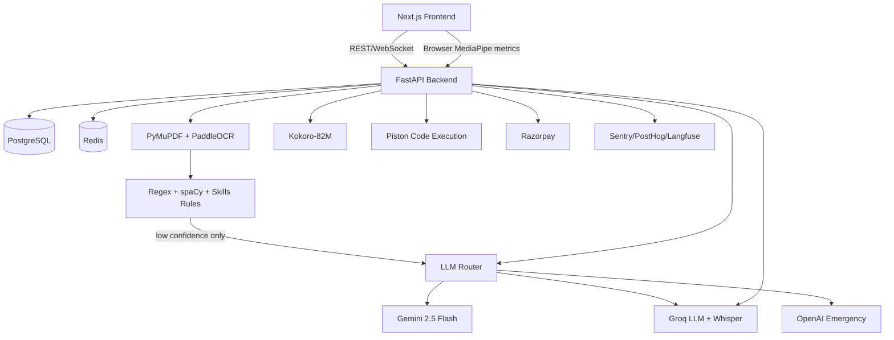

# InterAI V1 Production Architecture

## Principles

- Deterministic resume parsing first; AI extraction only when confidence is low.
- Gemini 2.5 Flash is the normal interview-generation path; Groq and OpenAI are failovers.
- Voice uses Groq Whisper for STT and self-hosted Kokoro-82M for TTS.
- Body-language analysis stays in the browser with MediaPipe. The backend accepts metrics, not frames.
- Technical mode is a separate controlled surface with Monaco, Piston, Excalidraw, and anti-cheat logging.

## System Diagram

## Interview Flow

1. User uploads a PDF or DOCX resume.
2. Backend extracts text with PyMuPDF. If PDF pages are scanned or sparse, it renders pages and uses PaddleOCR.
3. `resume_rules.py` extracts profile fields, skills, projects, education, and confidence.
4. If confidence is below `RESUME_AI_FALLBACK_CONFIDENCE`, the LLM router performs fallback extraction.
5. Starting an interview checks free daily cap and credits, then builds a resume-grounded knowledge map.
6. WebSocket audio chunks are transcribed by Groq Whisper.
7. Candidate answers are evaluated through the LLM router, with local heuristic quality flags merged into model feedback.
8. Browser MediaPipe metrics are sent as compact JSON and stored as client body-language metrics.
9. Completion builds a report and creates the next coaching cycle: speaking, listening, writing, and technical drill exercises.

## Technical Mode

Technical mode creates three rounds:

- DSA: Monaco editor with Python, JavaScript, and Java execution through Piston.
- System design: Excalidraw whiteboard persisted per round.
- Debugging: Monaco editor with live execution.

Anti-cheat events log tab switches, window blur, fullscreen exits, and paste attempts.

## Runtime Configuration

Core environment keys:

- `GEMINI_API_KEY`, `GEMINI_MODEL`
- `GROQ_API_KEY`, `GROQ_CHAT_MODEL`, `GROQ_WHISPER_MODEL`
- `OPENAI_API_KEY`, `OPENAI_CHAT_MODEL` for emergency failover
- `KOKORO_VOICE`, `KOKORO_SPEED`
- `RAZORPAY_KEY_ID`, `RAZORPAY_KEY_SECRET`, `RAZORPAY_WEBHOOK_SECRET`
- `SENTRY_DSN`, `POSTHOG_API_KEY`, `LANGFUSE_PUBLIC_KEY`, `LANGFUSE_SECRET_KEY`
- `FREE_INTERVIEW_DAILY_CAP=3`
- `PISTON_API_URL`

## V1 Exclusions

Stripe, DeepFace, Docling, OpenAI Whisper, OpenAI TTS, and server-side frame analysis are intentionally excluded from V1.
